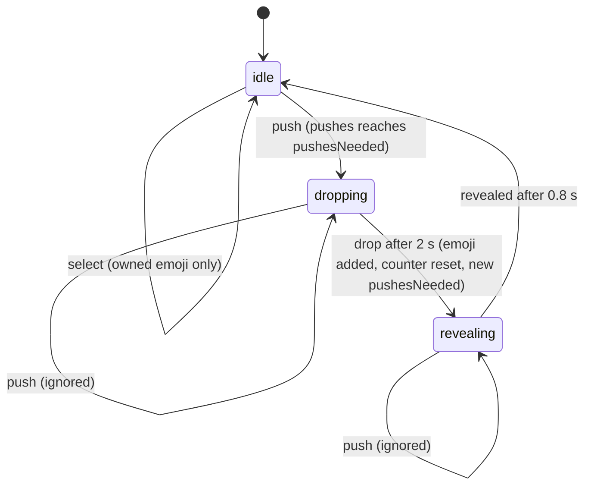

# Architecture

## Game loop

Each tap is a **push**. After a random number of pushes (1–60, rolled per drop) the emoji
**drops** a new one: the 💩 animation plays for 2 s, then the rolled emoji is added to the
collection and becomes the selected emoji. The new emoji then animates in for 0.8 s (pop-in
plus the stage photo's blur-out). The stage ignores taps from the drop until the reveal ends:
the reducer drops the pushes, and the button is `aria-disabled` with no hover or press
feedback.



## Data flow

```
 tap ─▶ PooButton.onPush ─▶ useGame.push
                              ├─ play sound (unless muted)
                              ├─ dispatch({ type: "push" })            ─▶ gameReducer (pure)
                              └─ if this push completes the drop:
                                   roll emoji now, then after 2 s
                                   dispatch({ type: "drop", emoji, pushesNeeded }) + vibrate,
                                   then after 0.8 s dispatch({ type: "revealed" })

 state ─▶ App ─▶ PooButton / DropToast / CollectionPanel (derived: sortCollection, rarityStats)
 state.{selected, clicks, collection} ─▶ useEffect ─▶ writeSave (localStorage)
```

- `gameReducer.ts` is pure and fully unit-tested. Randomness enters only through action
  payloads.
- `useGame.ts` owns every side effect: sound, the drop timer, persistence and haptics.
- Collection views are derived on each render with `sortCollection` / `rarityStats`. The React
  Compiler memoizes components, so there's no manual caching.

## Rarity and odds

`RARITIES` in `features/game/rarity.ts` is ordered rarest → most common. Weights are basis
points (1/100 %) and sum to 10,000, so they read directly as the published rates. A drop rolls a
tier first, then picks uniformly among that tier's emojis:

| Rarity      | Weight | Chance per drop |  1 in | Emojis | Each emoji |
| ----------- | -----: | --------------: | ----: | -----: | ---------: |
| Galaxy Opal |      5 |           0.05% | 2,000 |      1 |     0.050% |
| Mythic      |     25 |           0.25% |   400 |      4 |     0.063% |
| Legendary   |    120 |           1.20% |    83 |     12 |     0.100% |
| Epic        |    450 |           4.50% |    22 |     26 |     0.173% |
| Rare        |  1,200 |          12.00% |   8.3 |     36 |     0.333% |
| Uncommon    |  2,700 |          27.00% |   3.7 |     75 |     0.360% |
| Common      |  5,500 |          55.00% |   1.8 |    144 |     0.382% |

Tier sizes shrink with rarity so that **each single emoji is rarer than every emoji of a more
common tier** (the "Each emoji" column only ever grows downwards; a unit test enforces this).

**Categorization.** The tier comes from the emoji's theme, never from a one-off decision:

| Rarity      | Theme                                                                                          |
| ----------- | ---------------------------------------------------------------------------------------------- |
| Galaxy Opal | The one and only 💩, the game's namesake                                                       |
| Mythic      | Myths and the cosmos: unicorn, dragon, planet, alien                                           |
| Legendary   | Royalty and treasure: crowns, jewels, trophies, prizes                                         |
| Epic        | Legends and the unknown: monsters, spirits, relics, robots, space travel                       |
| Rare        | Wildlife and showbiz: wild and exotic animals, music, film, the stage                          |
| Uncommon    | People, pets and play: faces, gestures, people, small animals and bugs, sports, toys           |
| Common      | Everyday things: food and drink, nature and weather, clothes, home and office, vehicles, signs |

`EMOJIS_BY_RARITY` groups each tier by these sub-themes with comments. To add an emoji, find
its theme and append it there, then check that the per-emoji test still passes. Never remove an
emoji: saves reference them.

**Randomness.** Rolls use `secureRandom` (`shared/lib/random.ts`): 53-bit floats built from
`crypto.getRandomValues`. A drop never repeats the selected emoji: it's left out of its tier's
pool, so tier rates stay exact. Only when 💩 is showing and the roll lands on Galaxy Opal is the
tier rerolled.

## Persistence

Progress lives in `localStorage` under one key and is validated on every load:

```jsonc
// "poo-game:save"
{
  "version": 1,
  "selected": "🦄", // must be a known emoji, otherwise the save is ignored
  "clicks": 1234, // non-negative integer
  "collection": { "🦄": 2 }, // unknown emojis / non-positive counts are dropped
}
```

- `"poo-game:muted"` stores the sound toggle (boolean).
- **Legacy migration:** the 2022 version stored `collected_emojis`, `last_emoji` and `clicks`
  as `{ value, createdDate }` entries via `local-data-storage`. `loadSave()` converts them once
  into the v1 format and deletes the old keys.
- To change the format, bump `SAVE_VERSION`, migrate the previous version inside `loadSave()`,
  and cover it in `save.test.ts`.

## Styling system

- `src/app/index.css` holds the Tailwind entry point and `@theme` tokens: fonts, the rarity
  palette (`--color-common` … `--color-mythic`, `--color-galaxy-opal`) and animations (shine, drop, aurora, opal,
  pop-in, toast).
- Custom utilities there: `glass` (frosted panel), `rarity-*` (sets `--rarity`) and
  `opal-border` (animated iridescent border using a registered `@property`).
- Components pick up rarity colors via `RARITY_CLASS[rarity]` and then use
  `text-(--rarity)`, `bg-(--rarity)/12`, `shadow-[…var(--rarity)]`.
- **Stage photo** (`StageBackground`): the original meadow photo sits behind the clickable
  emoji. vite-imagetools turns the 1800 px source into AVIF and WebP srcsets (480–1600 w, about
  25–210 KB), a JPEG fallback and a 32 px WebP inlined as a data URL. The placeholder shows
  immediately, blurred and scaled (blur-up), and the full image fades in on `load`. When the
  emoji changes, the photo layer blurs out (blur 20 px → 0 via the Web Animations API). A rarity
  tint and a dark gradient on top keep the emoji readable.
- Reduced motion is handled globally in the base layer; the push squash (Web Animations API)
  checks `prefers-reduced-motion` itself.

## PWA

`vite-plugin-pwa` generates a Workbox service worker (`registerType: "autoUpdate"`) that
precaches HTML, JS, CSS, fonts, icons and sounds, so the game works fully offline after the
first visit. Images are cached at runtime (cache-first), so each device stores only the stage
photo size it actually loaded. `pwa-assets.config.ts` generates favicon, Apple touch, maskable and manifest icons
from `public/icon.svg` at build time.

## Testing strategy

| Layer      | Where                       | What                                                                               |
| ---------- | --------------------------- | ---------------------------------------------------------------------------------- |
| Unit       | `src/features/**/*.test.ts` | rolls (with fixed RNG), reducer, save/migration, sorting                           |
| Component  | `src/app/App.test.tsx`      | first run, deterministic drop (fake timers), select, filter, mute                  |
| End-to-end | `e2e/*.spec.ts`             | production build: drop + reload persistence, filter, popover, no overflow, offline |

To make a drop deterministic, make `crypto.getRandomValues` fill zeros (`stubRandomWords(0)` in `src/test`): one push is then enough, and
the drop is always 💩 (Galaxy Opal).
