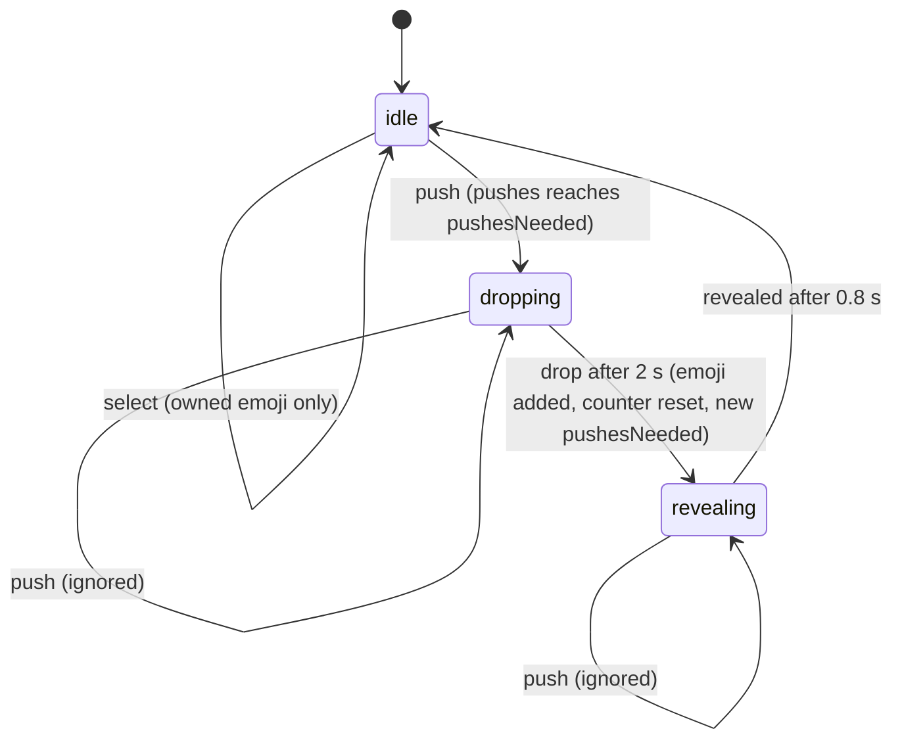

# Architecture

## Game loop

Each tap is a **push**. After a random number of pushes (1–60, rolled per drop) the emoji
**drops** a new one: the 💩 animation plays for 2 s, then the rolled emoji is added to the
collection and becomes the selected emoji. The new emoji then animates in for 0.8 s (pop-in
plus the stage photo's blur-out). The stage ignores taps from the drop until the reveal ends:
the reducer drops the pushes, and the button is `aria-disabled` with no hover or press
feedback.



## Data flow

```
 tap ─▶ PooButton.onPush ─▶ useGame.push
                              ├─ play sound (unless muted)
                              ├─ dispatch({ type: "push" })            ─▶ gameReducer (pure)
                              └─ if this push completes the drop:
                                   roll emoji now, then after 2 s
                                   dispatch({ type: "drop", emoji, pushesNeeded }) + vibrate,
                                   then after 0.8 s dispatch({ type: "revealed" })

 RootLayout ─ ProfilesProvider (profilesReducer, persisted) ─▶ <Outlet/> (route)
 GameLayout ─ GameScreen key={active.id} ─ useGame({ save: profile.save, onSave }) ─▶ PooButton / DropToast / CollectionPanel
 state.{selected, clicks, collection, pity} ─▶ useEffect ─▶ onSave ─▶ dispatch({ type: "save" })
                                                                   ─▶ writeProfiles (localStorage)
```

- `gameReducer.ts` is pure and fully unit-tested. Randomness enters only through action
  payloads.
- `useGame.ts` owns the game's side effects: sound, the drop timer and haptics. It reads its
  save once, so `GameScreen` is keyed by profile id: switching profiles remounts the game with
  the other save. Progress flows back through `onSave` (a `useEffectEvent`).
- Collection views are derived on each render with `sortCollection` / `rarityStats`. The React
  Compiler memoizes components, so there's no manual caching.

## Routing

TanStack Router (code-based, fully typed; `src/app/router.tsx`) under the `/poo-game/` base:

| Path                           | Screen                                                      |
| ------------------------------ | ----------------------------------------------------------- |
| `/`                            | the game; redirects to `/profiles` until someone has picked |
| `/faq`, `/changelog`, `/theme` | dialogs over the game (lazy-loaded)                         |
| `/profiles`                    | "Who's playing?"                                            |
| `/profiles/new`                | "Add profile" dialog over the picker                        |
| `/profiles/manage`             | "Manage profiles"                                           |
| `/profiles/manage/$profileId`  | "Edit profile" dialog (unknown ids go back to manage mode)  |
| anything else                  | `NotFound`                                                  |

- Dialogs are child routes rendered through an `<Outlet />` over their parent screen. They close
  with `useCloseRoute(fallback)`: history back when opened in the app, otherwise a replace to the
  fallback, so the Back button never reopens a closed dialog or leaves the app.
- "Who's playing?" on launch: `ProfilesProvider.picked` starts false when there's more than one
  profile, and `/` redirects to `/profiles` until a profile is picked.
- **GitHub Pages** has no rewrites, so `scripts/spaFallbackPlugin.ts` copies `index.html` to
  `404.html` at build time and deep links load the app (with an HTTP 404 status). Offline, the
  service worker's navigation fallback serves `index.html` for every path.
- Tests render `<App history={createMemoryHistory({ initialEntries: ["/faq"] })} />`; memory
  history paths have no base prefix.

## Rarity and odds

`RARITIES` in `features/game/rarity.ts` is ordered rarest → most common. Weights are basis
points (1/100 %) and sum to 10,000, so they read directly as the published rates. A drop rolls a
tier first, then picks uniformly among that tier's emojis:

| Rarity      | Weight | Chance per drop |  1 in | Emojis | Each emoji |
| ----------- | -----: | --------------: | ----: | -----: | ---------: |
| Galaxy Opal |      5 |           0.05% | 2,000 |      1 |     0.050% |
| Mythic      |     25 |           0.25% |   400 |      4 |     0.063% |
| Legendary   |    120 |           1.20% |    83 |     12 |     0.100% |
| Epic        |    450 |           4.50% |    22 |     26 |     0.173% |
| Rare        |  1,200 |          12.00% |   8.3 |     36 |     0.333% |
| Uncommon    |  2,700 |          27.00% |   3.7 |     75 |     0.360% |
| Common      |  5,500 |          55.00% |   1.8 |    144 |     0.382% |

Tier sizes shrink with rarity so that **each single emoji is rarer than every emoji of a more
common tier** (the "Each emoji" column only ever grows downwards; a unit test enforces this).

**Categorization.** The tier comes from the emoji's theme, never from a one-off decision:

| Rarity      | Theme                                                                                          |
| ----------- | ---------------------------------------------------------------------------------------------- |
| Galaxy Opal | The one and only 💩, the game's namesake                                                       |
| Mythic      | Myths and the cosmos: unicorn, dragon, planet, alien                                           |
| Legendary   | Royalty and treasure: crowns, jewels, trophies, prizes                                         |
| Epic        | Legends and the unknown: monsters, spirits, relics, robots, space travel                       |
| Rare        | Wildlife and showbiz: wild and exotic animals, music, film, the stage                          |
| Uncommon    | People, pets and play: faces, gestures, people, small animals and bugs, sports, toys           |
| Common      | Everyday things: food and drink, nature and weather, clothes, home and office, vehicles, signs |

`EMOJIS_BY_RARITY` groups each tier by these sub-themes with comments. To add an emoji, find
its theme and append it there, then check that the per-emoji test still passes. Never remove an
emoji: saves reference them.

**Randomness.** Rolls use `secureRandom` (`shared/lib/random.ts`): 53-bit floats built from
`crypto.getRandomValues`. A drop never repeats the selected emoji: it's left out of its tier's
pool, so tier rates stay exact. Only when 💩 is showing and the roll lands on Galaxy Opal is the
tier rerolled.

**Bad-luck protection (pity).** `pity.ts` counts drops since the last Epic-or-better and
Legendary-or-better drop. The 30th drop without an Epic or better is guaranteed to be one, and the
150th without a Legendary or better likewise. A guaranteed roll only considers tiers at or above
that floor, keeping their relative weights (an Epic-floor roll is Legendary 20 %, Epic 75 %,
…). Pity makes the rare tiers slightly more frequent than the table in the long run; the table
is the rate of a single, unprotected roll. The counters are saved, so reloading doesn't reset
them.

## Profiles and persistence

A device can hold up to 5 **profiles** (`features/profiles`), each with a name, an avatar and its
own progress. With more than one, the app opens on a "Who's playing?" picker; the header avatar
button returns to it, and "Manage profiles" edits, adds or deletes them (never the last one).
`profilesReducer` is pure; `useProfiles` persists every change.

Everything lives in `localStorage` under one key, **sealed** so players can't casually read or
edit it (`shared/lib/sealedStorage.ts`): `"PGS1" + base64url(salt ‖ checksum ‖ XOR-scrambled
JSON)`. Like profile files, this deters casual cheating; it isn't security. The sound toggle
(`"poo-game:muted"`) is a plain boolean for the device, and so is the look:
`"poo-game:appearance"` holds `{ theme, mode }` (see [Themes](#themes)).

### Data format (schema v2)

`features/profiles/schema.ts` defines the stored data with **Valibot**; the TypeScript types
are inferred from it, and the same schema validates storage and imported profile files.

```jsonc
// "poo-game:profiles", after unsealing
{
  "format": "poo-game/save", // document kind; profile files use "poo-game/profile"
  "version": 2, // SAVE_VERSION
  "updatedAt": "2026-09-24T08:00:00.000Z",
  "appVersion": "0.1.2", // who wrote it (debugging only)
  "activeProfileId": "7c9e…",
  "profiles": [
    {
      "id": "7c9e…", // crypto.randomUUID()
      "name": "Mark", // 1–20 chars
      "avatar": "fox", // avatar id (AVATAR_IDS)
      "createdAt": "2026-09-20T12:00:00.000Z",
      "progress": {
        "selected": "unicorn", // emoji id
        "taps": 420,
        "collection": {
          // keyed by emoji id (game/emojiIds.ts), values are objects so they can grow
          "unicorn": { "count": 2, "firstFoundAt": "2026-09-21T09:30:00.000Z" },
        },
        "pity": { "sinceEpic": 3, "sinceLegendary": 40 },
      },
    },
  ],
}
```

Design choices that keep it easy to evolve:

- **Stable ids, not characters.** Emojis and avatars are stored by kebab-case ids (the emoji's
  Unicode CLDR name, e.g. `pile-of-poo`), so invisible variation selectors don't matter and a
  glyph can change. Ids never change or get reused; renamed emojis keep old ids working through
  `EMOJI_ID_ALIASES`.
- **Objects everywhere.** Collection entries are `{ count, firstFoundAt }`, not bare numbers,
  so new per-emoji data (e.g. `shiny`) is an additive field.
- **Unknown data survives.** Every schema object is a `looseObject`, and writes deep-merge over
  the document as loaded (`mergeKeepingUnknown` in `saveFile.ts`). An older app therefore keeps
  fields and emoji ids a newer one added, instead of deleting them.
- **Explicit versions and migrations.** Loading goes header → version check → `migrate()` →
  full schema (`readDocument`). `MIGRATIONS[n]` (in `migrations.ts`) turns version n into n + 1.
  There are none yet: v2 is the first versioned format.

How to change the format:

| Change                                               | What to do                                                                                                      |
| ---------------------------------------------------- | --------------------------------------------------------------------------------------------------------------- |
| Add an optional field or a new emoji                 | Just add it. No version bump; older apps keep it untouched.                                                     |
| Rename, remove, retype, change meaning, add required | Bump `SAVE_VERSION`, add `MIGRATIONS[old]`, keep the old version's pinned fixture loading (`saveFile.test.ts`). |
| Rename or replace an emoji                           | Keep its id, or add the old id to `EMOJI_ID_ALIASES`. Never reuse an id.                                        |

**Unusable data never gets overwritten.** `loadProfiles()` returns an error instead of state:
`outdated` (older than `OLDEST_READABLE_VERSION`, including v0.1.1's format), `newer` (from a
newer app; the player is told to reload) or `damaged` (edited, corrupt or invalid). The app
then shows `SaveErrorScreen` in place of the routes and writes nothing until the player chooses
**Remove saved data**, which deletes the save (not the sound setting) and starts fresh.

In development, `window.pooGameDev.writeSave(document)` / `.readSave()` seal and unseal the
stored document from the console (dev server only; see `src/dev/devTools.ts`).

### Profile files (import/export)

"Manage profiles" → a profile → **Export** downloads `poo-game-<name>.poo`. **Import profile** on
the picker adds a file as a new profile (fresh id, name made unique). The payload is a
`ProfileFileSchema` document (`format: "poo-game/profile"`, same version and migrations as
saves); v0.1.1 files are rejected as outdated. `profileFile.ts`:

```
"POO1" + base64url( salt[4] ‖ HMAC-SHA-256(salt ‖ scrambled)[16] ‖ scrambled )
scrambled = deflate-raw(JSON { name, avatar, save }) XOR xorshift32 stream(secret, salt)
```

- The file is unreadable, looks different on every export (random salt), and any edit fails the
  HMAC check: "This profile file was modified or is damaged."
- It's **obfuscation, not security**: the key ships in the bundle, so a determined player could
  forge a file. That's acceptable for a local, single-player game.
- Decoded data goes through the same schema, version check and migrations as storage.
- The `POO1` prefix versions the format. A new format gets a new prefix, and `decodeProfile`
  must keep accepting every older one.

## Styling system

- `src/app/index.css` holds the Tailwind entry point and `@theme` tokens: fonts, the rarity
  palette (`--color-common` … `--color-mythic`, `--color-galaxy-opal`) and animations (shine sweep and rays, drop, aurora, opal,
  pop-in, toast).
- Custom utilities there: `glass` (frosted panel), `rarity-*` (sets `--rarity`) and
  `opal-border` (animated iridescent border using a registered `@property`).
- Components pick up rarity colors via `RARITY_CLASS[rarity]` and then use
  `text-(--rarity)`, `bg-(--rarity)/12`, `shadow-[…var(--rarity)]`.
- **Stage photo** (`StageBackground`): the original meadow photo sits behind the clickable
  emoji. vite-imagetools turns the 1800 px source into AVIF and WebP srcsets (480–1600 w, about
  25–210 KB), a JPEG fallback and a 32 px WebP inlined as a data URL. The placeholder shows
  immediately, blurred and scaled (blur-up), and the full image fades in on `load`. When the
  emoji changes, the photo layer blurs out (blur 20 px → 0 via the Web Animations API). A rarity
  tint and a dark gradient on top keep the emoji readable.
- **Motion system** (`index.css`): easing tokens `--ease-spring` / `--ease-out-expo` and
  `animate-*` tokens (float, ripple, bump, rise-in, burst, shockwave, tile-in, sheen, …);
  `modal-motion` (dialog enter/exit via `@starting-style` and `data-closing`), `accordion`
  (`::details-content` height with `interpolate-size`), and view transitions typed `screen`
  for route changes between screens.
- Reduced motion is handled globally in the base layer (animations, transitions and view
  transitions); the push squash (Web Animations API) and Modal's exit check
  `prefers-reduced-motion` themselves.

## PWA

`vite-plugin-pwa` generates a Workbox service worker (`registerType: "autoUpdate"`) that
precaches HTML, JS, CSS, fonts, icons and sounds, so the game works fully offline after the
first visit. Images are cached at runtime (cache-first), so each device stores only the stage
photo size it actually loaded. `pwa-assets.config.ts` generates favicon, Apple touch, maskable and manifest icons
from `public/icon.svg` at build time.

## Themes

`features/theme` lets players pick a **theme** (Aurora, Retro Web, Terminal, Luxe; `THEMES` in
`themes.ts`) and a **color mode** (system, light or dark) on the `/theme` dialog. The choice is
per device and never part of the save.

- `ThemeProvider` (under `RootLayout`) resolves `system` with `prefers-color-scheme`, sets
  `data-theme` and `data-mode="light|dark"` on `<html>`, updates `<meta name="theme-color">`
  and persists the choice. Changes cross-fade with a view transition.
- An inline script in `index.html` sets the same attributes before the first paint, so a
  reload never flashes the default theme.
- All styling goes through semantic tokens (`fg`, `muted`, `canvas`, `accent`, `on-accent`,
  `danger`, `rounded-pill`, `rounded-stage`, the `glass` surface), whose values each theme and
  mode sets in `features/theme/themes.css`. Rarity colors get deeper in light mode so labels
  keep their contrast.
- Any element with `data-theme` and `data-mode` renders its subtree in that theme: the picker's
  previews rely on this, so every theme block sets every variable.

To add a theme: add it to `THEMES` and `CANVAS_COLOR`, then add a `[data-theme="…"]` block
(dark values) and a `[data-theme="…"][data-mode="light"]` block to `themes.css`. Check every
screen in both modes for WCAG AA contrast.

## Testing strategy

| Layer      | Where                       | What                                                                                                |
| ---------- | --------------------------- | --------------------------------------------------------------------------------------------------- |
| Unit       | `src/features/**/*.test.ts` | rolls (with fixed RNG), reducer, save/migration, sorting                                            |
| Component  | `src/app/App.test.tsx`      | first run, deterministic drop (fake timers), select, filter, mute                                   |
| End-to-end | `e2e/*.spec.ts`             | production build: drop + persistence, filter, FAQ, changelog, profiles, theme, no overflow, offline |

To make a drop deterministic, make `crypto.getRandomValues` fill zeros (`stubRandomWords(0)` in `src/test`): one push is then enough, and
the drop is always 💩 (Galaxy Opal).
